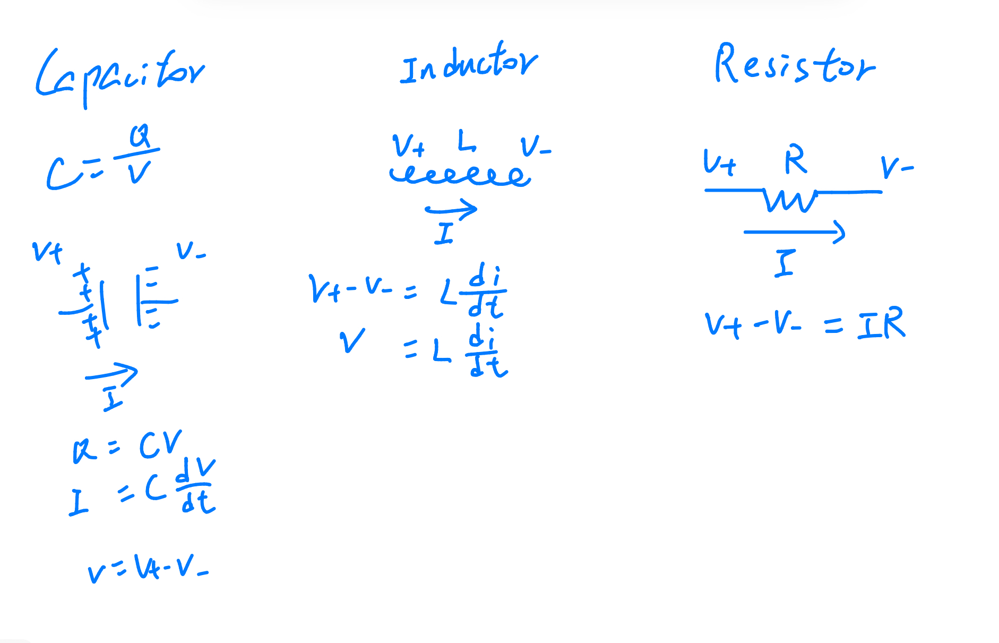

# Inductor and Capacitor Voltage-Current Relationship Diagrams

## RLC Circuit Reference Diagram



*This RLC circuit demonstrates how inductors and capacitors interact with resistors in dynamic systems.*

---

## 1. Inductor (L)

### Schematic Diagram
```
      Current i(t) →
      ┌───┐
      │   │   Voltage v_L(t) = v1 - v2
v1 ───┤ L ├─── v2
      │   │   (v1 is high potential)
      └───┘
      
Potential relationship: When v1 > v2, i increases
                      When v1 < v2, i decreases
```

### Formula
\[
v_L(t) = L \frac{di(t)}{dt} = v_1(t) - v_2(t)
\]

**Direction Convention**:
- **Voltage positive direction**: From v1 to v2 (v1 is +, v2 is -)
- **Current positive direction**: From v1 to v2
- **Physical meaning**: Voltage across inductor is proportional to current change rate

---

## 2. Capacitor (C)

### Schematic Diagram
```
      Current i(t) →
      ┌───┐
      │   │   Voltage v_C(t) = v1 - v2
v1 ───┤ C ├─── v2
      │   │   (v1 is high potential)
      └───┘
      
Potential relationship: Current flows into capacitor → v1 > v2 and v_C increases
                      Current flows out of capacitor → v1 < v2 and v_C decreases
```

### Formula
\[
i(t) = C \frac{dv_C(t)}{dt}
\]
or
\[
\frac{dv_C(t)}{dt} = \frac{i(t)}{C}
\]

**Direction Convention**:
- **Voltage positive direction**: From v1 to v2
- **Current positive direction**: **Into** capacitor positive terminal (v1 side) is positive
- **Physical meaning**: Capacitor current is proportional to voltage change rate

---

## 3. Memory Aids

### Inductor Mnemonic
```
Voltage difference = L × (Current change speed)
"Inductor opposes current change"
```

### Capacitor Mnemonic
```
Current = C × (Voltage change speed)
"Capacitor opposes voltage change"
```

### Quick Sign Check
| Component | If i increases | If i decreases |
|-----------|---------------|---------------|
| Inductor | v1 > v2 | v1 < v2 |
| Capacitor | If i flows into capacitor | v_C increases | v_C decreases |

---

## 4. Typical Cases in Actual Circuits

### Inductor in RLC Series Circuit
```
Vi ── R ── L ── C ── GND
         i→   i→
        v_L   v_C
```
Here: \( v_L = L \frac{di}{dt} \), \( v_C = \frac{1}{C} \int i \, dt \)

### Capacitor Charging/Discharging
```
Charging:     Discharging:
+─/\/\/─┤├─ -    +─┤├─/\/\/─ -
Power        C         C     Load
```
Charging: Current flows into capacitor → \( \frac{dv_C}{dt} > 0 \)  
Discharging: Current flows out of capacitor → \( \frac{dv_C}{dt} < 0 \)

---

**Remember these two diagrams to master the core of circuit modeling**: All dynamic characteristics of energy storage elements originate from these two basic relationships.